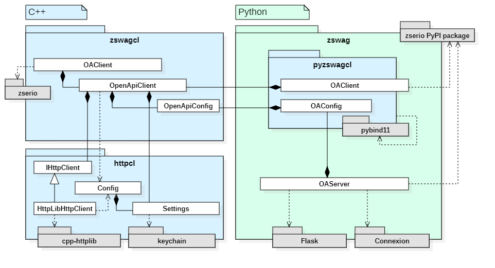

# Zswag

[](https://github.com/Klebert-Engineering/zswag/actions/workflows/cmake.yml)

zswag is a set of libraries for using/hosting zserio services through OpenAPI.

## Components



The zswag repository provides two main libraries which deliver
generic zserio OpenAPI in Python and C++. A generic OpenAPI server
for Python is also provided. Here is a detailed list of the
included libraries:

* `zswagcl` is a C++ Library which exposes zserio OpenApi service client `ZsrClient`
  as well as the more generic `OpenApiClient` and `OpenApiConfig` classes
  which are reused in Python.
* `zswag` is a Python Library which provides both a zserio Python service client
  (`OAClient`) as well as a zserio-OpenApi server layer based on Flask/Connexion
  (`OAServer`).
* `pyzswagcl` is a binding library which exposes the C++-based OpenApi
  pasrsing/request functionality to Python. Please consider it "internal".
* `httpcl` is a wrapper around the [cpp-httplib](https://github.com/yhirose/cpp-httplib),
  and http request configuration and secret injection abilities.
  
## Setup

### For Python Users

Simply run `pip install zswag`. **Note: This currently only works with
64-bit Python 3.8. Also, make sure that your `pip --version` is greater
than 19.3.**

### For C++ Users

Using CMake, you can ...

* 🌟run tests.
* 🌟build the zswag wheels for Python != 3.8.
* 🌟[integrate the C++ client into a C++ project.](#using-the-c-client)

The basic setup follows the usual CMake configure/build steps:
```bash
mkdir build && cd build
cmake ..
cmake --build .
```

**Note:** The Python environment used for configuration will be used
to build the resulting wheels. After building, you will find the Python
wheels under `build/bin/wheel`.

**To run tests**, just execute CTest at the top of the build directory:
```bash
cd build && ctest --verbose
```

## Using the Server Component (Python)

The `OAServer` component gives you the power to marry a zserio-generated app
server class with a user-written app controller and a fitting OpenAPI specification.

### Integration Example

Let's consider the following zserio service saved under `myapp/service.zs`:

```
package service;

struct Request {
  int32 value;
};

struct Response {
  int32 value;
};

service MyService {
  Response my_api(Request);
};
```

**Note:** `myapp` must be available as a module (it must be
possible to `import myapp`). We recommend to run the zserio Python generator
invocation inside the `myapp` module's `__init__.py`:

```py
import zserio
from os.path import dirname, abspath

working_dir = dirname(abspath(__file__))
zserio.generate(
  zs_dir=working_dir,
  main_zs_file="service.zs",
  gen_dir=working_dir)
```

A server script like `myapp/server.py` might then look as follows:

```py
import zswag
import myapp.controller as controller
from myapp import working_dir

# This import only works after zserio generation.
import service.api as service

app = zswag.OAServer(
  controller_module=controller,
  service_type=service.MyService.Service,
  yaml_path=working_dir+"/api.yaml",
  zs_pkg_path=working_dir)

if __name__ == "__main__":
    app.run()
```

The server script above references two important components:
* An **OpenAPI file** (`myapp/api.yaml`): Upon startup, `OAServer`
  will output an error message if this file does not exist. The
  error message already contains the correct command to
  invoke the [OpenAPI Generator CLI](#using-the-openapi-generator-cli)
  to generate `myapp/api.yaml`.
* A **controller module** (`myapp/controller.py`): This file provides
  the actual implementations for your service endpoints.
  
For the current example, `controller.py` might look as follows:

```py
import service.api as service

# Written by you
def my_api(request: service.Request):
    return service.Response(request.value * 42)
```

## Using the Python Client

The generic Python client talks to any zserio service that is running
via HTTP/REST, and provides an OpenAPI specification of it's interface.

### Integration Example

As an example, consider a Python module called `myapp` which has the
same `myapp/__init__.py` and `myapp/service.zs` zserio definition as
[previously mentioned](#using-the-server-component-python). We consider
that the server is providing its OpenAPI spec under `localhost:5000/openapi.json`.

In this setting, a client `myapp/client.py` might look as follows:

```python
from zswag import OAClient
import service.api as service

openapi_url = f"http://localhost:5000/openapi.json"

# The client reads per-method HTTP details from the OpenAPI URL.
# You can also pass a local file by setting the `is_local_file` argument
# of the OAClient constructor.
client = service.MyService.Client(OAClient(openapi_url))

# This will trigger an HTTP request under the hood.
client.my_api(service.Request(1))
```

As you can see, an instance of `OAClient` is passed into the constructor
for zserio to use as the service client's transport implementation.

**Note:** While connecting, the client will also pass ...
1. [Authentication headers/cookies](#authentication-via-headers-and-cookies).
2. Additional HTTP headers passed into the `OAClient` constructor as a
   dictionary like `{HTTP-Header-Name: Value}`

## Using the C++ Client

The generic C++ client talks to any zserio service that is running
via HTTP/REST, and provides an OpenAPI specification of it's interface.
The C++ client is based on the [ZSR zserio C++ reflection](https://github.com/klebert-engineering/zsr)
extension.

### Integration Example

As an example, we consider the `myapp` directory which contains a `service.zs`
zserio definition as [previously mentioned](#using-the-server-component-python).

We assume that zswag is added to `myapp` as a [Git submodule](https://git-scm.com/book/en/v2/Git-Tools-Submodules)
under `myapp/zswag`.

Next to `myapp/service.zs`, we place a `myapp/CMakeLists.txt` which describes our project:

```cmake
project(myapp)

# This is how C++ will know about the zswag lib
# and its dependencies, such as zserio.
add_subdirectory(zswag)

# This command is provided by ZSR to easily create
# a CMake C++ reflection library from zserio code.
add_zserio_module(${PROJECT_NAME}-cpp
  ROOT "${CMAKE_CURRENT_SOURCE_DIR}"
  ENTRY service.zs
  TOP_LEVEL_PKG service
  SUBDIR_DEPTH 0)

# We create a myapp client executable which links to
# the generated zserio C++ library, the zswag client
# library and the ZSR reflection runtime.
add_executable(${PROJECT_NAME} client.cpp)
target_link_libraries(${PROJECT_NAME}
    ${PROJECT_NAME}-cpp-reflection zswagcl zsr)
```

The `add_executable` command above references the file `myapp/client.cpp`,
which contains the code to actually use the zswag C++ client. Again, the
code assumes that the server provides their OpenAPI definitions under
`localhost:5000/openapi.json`:

```cpp
#include "zswagcl/zsr-client.hpp"
#include <iostream>
#include <zsr/types.hpp>
#include <zsr/find.hpp>
#include <zsr/getset.hpp>

using namespace zswagcl;
using namespace httpcl;

int main (int argc, char* argv[])
{
    // Instantiate the client
    auto openApiUrl = "http://localhost:5000/openapi.json";
    auto httpClient = std::make_unique<HttpLibHttpClient>();
    auto openApiConfig = fetchOpenAPIConfig(specUrl, *httpClient);
    auto zsrClient = ZsrClient(openApiConfig, std::move(httpClient));
    
    // Invoke the REST endpoint
    auto response = zsr::find<zsr::ServiceMethod>("service.MyService.my_api")->call(
        zsrClient,
        zsr::make(zsr::packages(), "service.Request", {{"value", 2}})
    ).get<zsr::Introspectable>().value();
    
    // Print the response
    std::cout << "Got "
              << zsr::get(response, "value").get<int>().value()
              << std::endl;
}
```

Unlike the Python client, the C++ OpenAPI client (`ZsrClient`) is passed directly to
the endpoint method invocation, not to an intermediate zserio Client object.

**Note:** While connecting, `ZsrClient` will also pass ...
1. [Authentication headers/cookies](#authentication-via-headers-and-cookies).
2. Additional HTTP headers passed into the `OAClient` constructor
   as key-value-pairs in an `std::map<string, string>`.

## Using the OpenAPI Generator CLI

🚧 This section is work-in-progress. 🚧

## Authentication via Headers and Cookies

🚧 This section is work-in-progress. 🚧

## UI 

If you have installed `pip install "connexion[swagger-ui]"`, you can view
API docs of your service under `[/prefix]/ui`.

## Interoperability

The Server, Clients and Generator currently  offer several degrees of freedom
regarding HTTP-specifics in the OpenAPI YAML file:

* **HTTP Method**
* **Parameter Format**
* **Server URL Base Path**

The following sections detail which components support which aspects
of OpenAPI. The difference in compliance is mostly due to limited
development scopes. If you are missing a particular OpenAPI feature for
a particular component, feel free to create an issue!

#### Aspect 🌟1: HTTP method

To change the **HTTP method**, simply place the desired method
as the key under the method path, such as in the following example:
```yaml
paths:
  /methodName:
    {get|post|put|patch|delete}:
      ...
```

#### Aspect 🌟2: Zserio request blob in body

```yaml
requestBody:
  content:
    application/x-zserio-object:
      schema:
        type: string
```

#### Aspect 🌟3: Zserio request blob in URL parameter

```yaml
parameters:
- description: ''
  in: query|path
  name: parameterName
  required: true
  x-zserio-request-part: "*"
  schema:
    format: string|byte|base64|base64url|hex|binary
```

About the `format` specifier value:
* Both `string` and `binary` result in a raw URL-encoded string.
* Both `byte` and `base64` result in a standard Base64-encoded value.
  The `base64url` option indicates URL-safe Base64 format.
* The `hex` encoding produces a hexadecimal encoding of the request blob.

#### Aspect 🌟4: Zserio request part, single value

```yaml
parameters:
- description: ''
  in: query|path
  name: parameterName
  required: true
  x-zserio-request-part: "field[.subfield]*"
  schema:
    format: string|byte|base64|base64url|hex|binary
```

In this case, `x-zserio-request-part` should point to an atomic built-in type,
such as `uint8`, `float32`, `extern` etc. Note that `uint8[]` array fields receive
special treatment: They are transferred as single-value blobs, not as arrays.

The `format` value effect remains as explained above. A small
difference exists for integer types: Their hexadecimal representation
will be the natural numeric one, not the binary. 

#### Aspect 🌟5: Zserio request part, array

```yaml
parameters:
- description: ''
  in: query|path
  style: form|simple|label|matrix
  explode: true|false
  name: parameterName
  required: true
  x-zserio-request-part: "field[.subfield]*"
  schema:
    format: string|byte|base64|base64url|hex|binary
```

In this case, `x-zserio-request-part` should point to an array of
atomic built-in types. The array will be encoded according
to the `format`, `style` and `explode` specifiers.

#### Aspect 🌟6: Zserio request part, dictionary

In this case, `x-zserio-request-part` should point to a zserio struct.
The OpenAPI schema options are the same as for arrays. All fields
of the designated struct which have an atomic built-in type are exposed
as key-value pairs.  The key-value-pairs will be encoded according
to the `format`, `style` and `explode` specifiers.

#### Aspect 🌟7: Server URL Base Path

OpenAPI allows for a `servers` field in the spec that lists URL path prefixes
under which the specified API may be reached. A `zswag_client.HttpClient`
instance looks into this list and determines the URL base path it uses from
the first entry in this list. A sample entry might look as follows:
```
servers:
- http://unused-host-information/path/to/my/api
``` 
The `zswag_client.HttpClient` will then call methods with your specified host
and port, but prefix the `/path/to/my/api` string. 

## Documentation extraction

When the OpenAPI/Swagger YAML is auto-generated, `Server`
tries to populate the service/method/argument/result descriptions
with doc-strings which are extracted from the zserio sources.

For structs and services, the documentation is expected to be
enclosed by `/*! .... !*/` markers preceding the declaration:

```C
/*!
### My Markdown Struct Doc
I choose to __highlight__ this word.
!*/

struct MyStruct {
    ...
}
``` 

For service methods, a single-line doc-string is parsed which
immediately precedes the declaration:

```C
/** This method is documented. */
ReturnType myMethod(ArgumentType);
```

