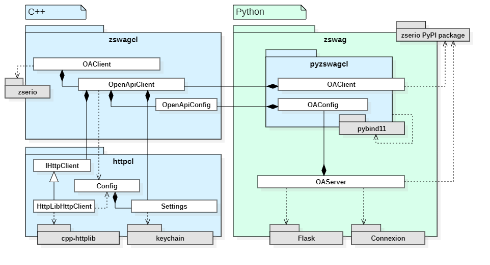

# Zswag

[](https://github.com/ndsev/zswag/actions/workflows/build-deploy.yml)
[](https://codecov.io/github/ndsev/zswag)
[](https://sonarcloud.io/summary/new_code?id=ndsev_zswag)
[](https://GitHub.com/ndsev/zswag/releases/)
[](https://sonarcloud.io/summary/new_code?id=ndsev_zswag)
[](https://github.com/ndsev/zswag/blob/master/LICENSE)

zswag is a set of libraries for using and hosting [zserio](http://zserio.org) services through OpenAPI/REST. It provides parallel client implementations in Python, C++, and Java that consume the same OpenAPI specification, plus a Python server layer for exposing zserio services.

## Components



| Component | Language | Role |
|---|---|---|
| `zswagcl` | C++ | Core OpenAPI client (`OAClient`, `OpenApiClient`, `OpenApiConfig`); reused by the Python client via pybind11. |
| `httpcl` | C++ | HTTP wrapper around [cpp-httplib](https://github.com/yhirose/cpp-httplib); request configuration; OS keychain integration via [`keychain`](https://github.com/hrantzsch/keychain). |
| `zswag` | Python | Python `OAClient`, the Flask/Connexion-based `OAServer`, and the `zswag.gen` OpenAPI generator. |
| `pyzswagcl` | Python | pybind11 bindings exposing `zswagcl` to Python. **Internal.** |
| `jzswag-api` | Java | Platform-agnostic contracts (`HttpConfig`, `HttpSettings`, `OpenAPIParameter`, `IHttpClient`, `IKeychain`, …). No third-party deps. |
| `jzswag-shared` | Java | Portable core: OpenAPI dispatch, `x-zserio-request-part`, parameter encoding, OAuth2/OAuth1 token endpoint flow, YAML loader. Used by both platform modules. |
| `jzswag-jvm` | Java | JVM port using JDK 11 `HttpClient`. Runs on any standard JVM (server, desktop, lambda, CLI). Implements zserio's `ServiceClientInterface`. |
| `jzswag-android` | Java | Android port using OkHttp + Android Keystore + AES-GCM-encrypted SharedPreferences. Implements zserio's `ServiceClientInterface`. |

## Per-language documentation

Detailed guides for each client + the server + the generator:

- [`docs/python.md`](docs/python.md) — Python `OAClient` and `OAServer`.
- [`docs/cpp.md`](docs/cpp.md) — C++ client and CMake integration.
- [`docs/java.md`](docs/java.md) — Java client.
- [`docs/openapi-generator.md`](docs/openapi-generator.md) — `zswag.gen` CLI reference.

The shared YAML format for `HTTP_SETTINGS_FILE` (used by all three clients) is documented in the [HTTP Settings File](#http-settings-file) section below.

## Quick start

### Python

```bash
pip install zswag
```

```python
from zswag import OAClient
import services.api as services

client = services.MyService.Client(OAClient("http://localhost:5000/openapi.json"))
client.my_api(services.Request(1))
```

### C++

In your `CMakeLists.txt`:

```cmake
FetchContent_Declare(zswag
    GIT_REPOSITORY https://github.com/ndsev/zswag.git
    GIT_TAG v1.11.1)
FetchContent_MakeAvailable(zswag)

add_zserio_library(myapp-zserio-cpp
    WITH_REFLECTION
    ROOT "${CMAKE_CURRENT_SOURCE_DIR}"
    ENTRY services.zs
    TOP_LEVEL_PKG myapp_services)

target_link_libraries(myapp myapp-zserio-cpp zswagcl)
```

```cpp
auto httpClient = std::make_unique<httpcl::HttpLibHttpClient>();
auto config = zswagcl::fetchOpenAPIConfig("http://localhost:5000/openapi.json", *httpClient);
auto transport = zswagcl::OAClient(config, std::move(httpClient));
auto client = MyService::Client(transport);
auto resp = client.myApiMethod(Request(1));
```

### Java (JVM)

```gradle
dependencies {
    implementation project(':libs:jzswag:jzswag-jvm')
    implementation "io.github.ndsev:zserio-runtime:2.16.1"
}
```

```java
import io.github.ndsev.zswag.jvm.ZswagClient;

ZswagClient transport = new ZswagClient("http://localhost:5000/openapi.json");
MyService.MyServiceClient client = new MyService.MyServiceClient(transport);
Response r = client.myApiMethod(new Request(1));
```

### Java (Android)

```gradle
dependencies {
    implementation project(':libs:jzswag:jzswag-android')
    implementation "io.github.ndsev:zserio-runtime:2.16.1"
}
```

```java
import io.github.ndsev.zswag.android.ZswagClient;

ZswagClient transport = new ZswagClient(context, "http://localhost:5000/openapi.json");
MyService.MyServiceClient client = new MyService.MyServiceClient(transport);
Response r = client.myApiMethod(new Request(1));
```

The only difference is the `Context` parameter on the constructor — needed so `AndroidKeychain` can reach `SharedPreferences` for credential storage.

## Setup details

### Python users

Wheels are published for 64-bit Python 3.10–3.13 on Linux (x86_64), macOS (x86_64 / arm64), and Windows (x64). On Windows install the [Microsoft Visual C++ Redistributable](https://aka.ms/vs/16/release/vc_redist.x64.exe).

### C++ users

zswag uses CMake's `FetchContent` for dependencies; CMake ≥ 3.22.3 required. See [`docs/cpp.md`](docs/cpp.md) for full build options including offline / disconnected builds and code coverage.

### Java users

Java 11+ source/target. The integration test depends on `pip install zswag` for its counterparty server. See [`docs/java.md`](docs/java.md).

## CI/CD and Release Process

The project uses GitHub Actions for automated build and deploy:

- **Platforms**: Linux (x86_64), macOS (Intel x86_64 and Apple Silicon arm64), Windows (x64).
- **Python versions**: 3.10, 3.11, 3.12, 3.13.
- **Triggers**: Pull requests, pushes to main, version tags.

### Release process

1. Update `ZSWAG_VERSION` in `CMakeLists.txt` (and the matching version in root `build.gradle`).
2. Tag commit with `v{version}` (e.g. `v1.11.1`).
3. CI validates that the tag version matches the CMake version and deploys wheels to PyPI.

### Development snapshots

Pushes to `main` create development releases — version format `{base_version}.dev{commit_count}` (e.g. `1.11.1.dev3`) — automatically deployed to PyPI for testing.

## Client environment variables

<!-- --8<-- [start:env] -->

| Variable | Effect |
|---|---|
| `HTTP_SETTINGS_FILE` | Path to YAML settings file (see [HTTP Settings File](#http-settings-file) below). Empty/unset → no persistent config. |
| `HTTP_LOG_LEVEL` | Verbosity (`debug`, `trace`). Useful for OAuth2 troubleshooting. |
| `HTTP_LOG_FILE` | Logfile path with rotation (Python/C++); not yet wired in Java. |
| `HTTP_LOG_FILE_MAXSIZE` | Rotation size in bytes; default 1 GB (Python/C++ only). |
| `HTTP_TIMEOUT` | Request timeout (connect + transfer) in seconds. Default 60. |
| `HTTP_SSL_STRICT` | Non-empty value enables strict SSL certificate validation. |

<!-- --8<-- [end:env] -->


## HTTP Settings File

<!-- --8<-- [start:settings] -->

The Python (`OAClient` / `HttpLibHttpClient`), C++, and Java clients all read a YAML file pointed to by the `HTTP_SETTINGS_FILE` environment variable. The format is identical across all three clients — the same file works for all of them.

If `HTTP_SETTINGS_FILE` is unset or empty, no persistent settings are applied.

### Schema

```yaml
http-settings:
  - scope: "*"          # URL match pattern (glob), e.g. https://*.example.com/*
                        # Use 'url:' instead for raw regex.
    basic-auth:         # Basic auth credentials for matching requests.
      user: johndoe
      keychain: keychain-service-string   # OR
      password: cleartext-password
    proxy:              # HTTP proxy.
      host: localhost
      port: 8888
      user: test                          # optional
      keychain: ...                       # OR
      password: cleartext-password
    cookies:            # Additional cookies for matching requests.
      key: value
    headers:            # Additional headers.
      X-Trace: enabled
    query:              # Additional query parameters.
      api_version: v2
    api-key: value      # API key — auto-routed to header/query/cookie based on the
                        # OpenAPI scheme's 'in:' (see Authentication Schemes section).
    oauth2:
      clientId: my-client-id              # REQUIRED
      clientSecretKeychain: kc-string     # RECOMMENDED — load from keychain
      clientSecret: cleartext-secret      # OR cleartext (discouraged)
      tokenUrl: https://issuer/oauth/token
      refreshUrl: https://issuer/oauth/token  # optional; defaults to tokenUrl
      audience: https://api.example.com/  # optional
      scope: ["api.read", "api.write"]    # optional override of per-operation scopes
      useForSpecFetch: true               # optional, default true
      tokenEndpointAuth:
        method: rfc6749-client-secret-basic   # OR rfc5849-oauth1-signature
        nonceLength: 16                       # only for rfc5849, range 8..64
```

A multi-scope file simply has multiple list entries; for a given request URL, **all matching scopes are merged** in declaration order, with later scopes overriding scalar fields. Multi-valued fields (`headers`, `query`, `cookies`) are unioned.

For `proxy` configs, `user` is optional; if `user` is set, then `password` or `keychain` is required.

### Scope matching

`scope:` is a shell-style glob with `*` as the only wildcard, matched against the full request URL after request building. Examples:

- `"*"` — matches all requests.
- `"https://*.foo.com/*"` — matches `https://api.foo.com/data` (the dot before `foo` is literal — `https://foo.com/` does NOT match).
- `"http://localhost:5555/*"` — matches local dev servers on a specific port.

To match by raw regex instead, use `url:` in place of `scope:`:

```yaml
http-settings:
  - url: "^https?://(api|admin)\\.example\\.com/.*$"
    headers: ...
```

### OAuth2

Only the `clientCredentials` flow is supported across all zswag clients. Other flows (`authorizationCode`, `implicit`, `password`) and OpenID Connect cause the spec parser to reject the security scheme.

#### Field requirements

| Field | Required? | Notes |
|---|---|---|
| `clientId` | Always | OAuth2 client identifier. |
| `tokenUrl` | When `useForSpecFetch: true` (default) | If `false`, the URL falls back to the spec's `flows.clientCredentials.tokenUrl`. |
| `clientSecret` / `clientSecretKeychain` | For confidential clients | Omit both for public clients (`client_id` goes in the request body). |
| `refreshUrl` | Optional | Defaults to spec value, then to `tokenUrl`. |
| `scope` | Optional | Defaults to per-operation scopes from the OpenAPI spec. |
| `audience` | Provider-specific | Some IdPs require it. |
| `useForSpecFetch` | Optional | Default `true`. Set `false` if the OpenAPI spec endpoint is publicly readable. |
| `tokenEndpointAuth` | Optional | Default `rfc6749-client-secret-basic`. |

#### Precedence rules

When both `http-settings.yaml` and the OpenAPI spec specify a value:

1. **`tokenUrl`** — `http-settings.yaml` overrides the spec's `flows.clientCredentials.tokenUrl`.
2. **`refreshUrl`** — `http-settings.yaml` overrides the spec's `flows.clientCredentials.refreshUrl`.
3. **`scope`** — `http-settings.yaml` overrides the per-operation `security` scopes.

#### Token endpoint authentication methods

Two authentication methods for the request **to the token endpoint** itself:

**`rfc6749-client-secret-basic` (default)** — RFC 6749 §2.3.1: `client_id:client_secret` in the `Authorization: Basic` header. Works with most providers.

**`rfc5849-oauth1-signature`** — RFC 5849: OAuth 1.0 HMAC-SHA256 signature. The token request is signed using the client secret; the secret itself is never transmitted. `nonceLength` controls the random nonce length (8–64). Required by some providers that use OAuth 1.0 signature-based token authentication.

#### Spec fetch protection

By default (`useForSpecFetch: true`), the OAuth2 token is acquired **before** fetching the OpenAPI specification, so a spec endpoint that itself requires authentication can be reached. Set `useForSpecFetch: false` if your spec is public — this defers token acquisition to the first API call, which is faster.

#### Debugging OAuth2

```bash
export HTTP_LOG_LEVEL=debug   # OAuth2 flow (mint/cache/refresh/auth method)
export HTTP_LOG_LEVEL=trace   # adds request/response bodies, signatures
```

### Keychain integration

Storing cleartext secrets in `http-settings.yaml` works but is discouraged. Use the `keychain:` field instead and pre-load the secret with the platform's native tool. The keychain "package" is `lib.openapi.zserio.client` (this is hardcoded across all zswag clients so secrets stored by one are visible to the others).

| Platform | Tool | Example |
|---|---|---|
| Linux | [`secret-tool`](https://www.marian-dan.ro/blog/storing-secrets-using-secret-tool) | `secret-tool store --label='zswag dev' package lib.openapi.zserio.client service my-service user my-user` |
| macOS | [`add-generic-password`](https://www.netmeister.org/blog/keychain-passwords.html) | `security add-generic-password -s my-service -a my-user -w 'thepassword'` |
| Windows | [`cmdkey`](https://www.scriptinglibrary.com/languages/powershell/how-to-manage-secrets-and-passwords-with-credentialmanager-and-powershell/) | (Java client: not yet implemented — use cleartext for now.) |

### Disabling persistent settings programmatically

To disable persistent settings (e.g. in tests), set the env var to empty:

```python
import os
os.environ['HTTP_SETTINGS_FILE'] = ''
```

```cpp
setenv("HTTP_SETTINGS_FILE", "", 1);
```

```java
// Java: pass HttpSettings.empty() explicitly to the client constructor.
```

<!-- --8<-- [end:settings] -->


## Result code handling

All clients treat any HTTP response other than `200` as an error and raise/throw a typed exception with a descriptive message. To accept other codes (e.g. `204 No Content`), catch the exception and inspect its status code.

## Swagger UI

If `pip install "connexion[swagger-ui]"` is available, `OAServer` exposes API docs at `[/prefix]/ui`.

## OpenAPI Options Interoperability

The Server, Clients, and Generator support different subsets of OpenAPI. The tables below detail which feature is supported by which component. Differences are mostly due to limited development scope — open an issue if you need something missing.

For options not supported by `zswag.gen`, edit the OpenAPI YAML by hand. You'll also need to edit it manually for spec-level metadata (provider name, service version, etc.).

### HTTP method

To change the HTTP method, place the desired method name as the key under the method path:

```yaml
paths:
  /methodName:
    {get|post|put|delete}:
      ...
```

| Feature | C++ Client | Python Client | Java Client | OAServer | zswag.gen |
|---|---|---|---|---|---|
| `get` `post` `put` `delete` | ✔️ | ✔️ | ✔️ | ✔️ | ✔️ |
| `patch` | ❌️ | ❌️ | ❌️ | ❌️ | ❌️ |

`patch` is intentionally unsupported across the stack: the partial-object-update semantics it implies cannot be realised in the zserio transport layer interface.

### Request body

Set `requestBody/content` to `application/x-zserio-object` to instruct clients to send the zserio request object in the body when using `post`/`put`/`delete`:

```yaml
requestBody:
  content:
    application/x-zserio-object:
      schema:
        type: string
```

| Feature | C++ Client | Python Client | Java Client | OAServer | zswag.gen |
|---|---|---|---|---|---|
| `application/x-zserio-object` | ✔️ | ✔️ | ✔️ | ✔️ | ✔️ |

### URL Blob Parameter

`x-zserio-request-part: "*"` indicates a parameter holds the whole zserio request as a blob:

```yaml
parameters:
- in: query|path|header
  name: parameterName
  required: true
  x-zserio-request-part: "*"
  schema:
    format: string|byte|base64|base64url|hex|binary
```

About `format`:
- `string` and `binary` produce a raw URL-encoded buffer.
- `byte` and `base64` produce standard Base64.
- `base64url` is URL-safe Base64.
- `hex` is hexadecimal.

When a parameter is in `path`, its value must not be empty (also applies to arrays).

| Feature | C++ Client | Python Client | Java Client | OAServer | zswag.gen |
|---|---|---|---|---|---|
| `x-zserio-request-part: *` | ✔️ | ✔️ | ✔️ | ✔️ | ✔️ |
| `format: string` | ✔️ | ✔️ | ✔️ | ✔️ | ✔️ |
| `format: byte` | ✔️ | ✔️ | ✔️ | ✔️ | ✔️ |
| `format: hex` | ✔️ | ✔️ | ✔️ | ✔️ | ✔️ |

### URL Scalar Parameter

`x-zserio-request-part` can also point to a scalar (nested) member of the request:

```yaml
parameters:
- in: query|path|header
  name: parameterName
  required: true
  x-zserio-request-part: "[parent.]*member"
  schema:
    format: string|byte|base64|base64url|hex|binary
```

For integer types, hex is the natural numeric representation, not binary.

| Feature | C++ Client | Python Client | Java Client | OAServer | zswag.gen |
|---|---|---|---|---|---|
| `x-zserio-request-part: <[parent.]*member>` | ✔️ | ✔️ | ✔️ | ✔️ | ✔️ |

### URL Array Parameter

`x-zserio-request-part` can point to an array member:

```yaml
parameters:
- in: query|path|header
  style: form|simple|label|matrix
  explode: true|false
  name: parameterName
  required: true
  x-zserio-request-part: "[parent.]*array_member"
  schema:
    format: string|byte|base64|base64url|hex|binary
```

The array is encoded according to `format`, `style`, and `explode` per [the OpenAPI 3.1 spec](https://github.com/OAI/OpenAPI-Specification/blob/master/versions/3.1.0.md#parameter-object).

| Feature | C++ Client | Python Client | Java Client | OAServer | zswag.gen |
|---|---|---|---|---|---|
| `x-zserio-request-part: <[parent.]*array_member>` | ✔️ | ✔️ | ✔️ | ✔️ | ✔️ |
| `style: simple` | ✔️ | ✔️ | ✔️ | ✔️ | ✔️ |
| `style: form` | ✔️ | ✔️ | ✔️ | ✔️ | ✔️ |
| `style: label` | ✔️ | ✔️ | ✔️ | ❌ | ✔️ |
| `style: matrix` | ✔️ | ✔️ | ✔️ | ❌ | ✔️ |
| `explode: true` | ✔️ | ✔️ | ✔️ | ✔️ | ✔️ |
| `explode: false` | ✔️ | ✔️ | ✔️ | ✔️ | ✔️ |

### URL Compound Parameter

Compound (struct-typed) `x-zserio-request-part` is unsupported across all components.

| Feature | C++ Client | Python Client | Java Client | OAServer | zswag.gen |
|---|---|---|---|---|---|
| `x-zserio-request-part: <[parent.]*compound_member>` | ❌️ | ❌️ | ❌️ | ❌️ | ❌️ |

### Server URL base path

Each client takes the URL base path from `servers[0]`:

```yaml
servers:
- http://unused-host-information/path/to/my/api
```

The host/port comes from the request, but the path prefix is taken from this entry.

| Feature | C++ Client | Python Client | Java Client | OAServer | zswag.gen |
|---|---|---|---|---|---|
| `servers` | ✔️ | ✔️ | ✔️ | ✔️ | ✔️ |

### Authentication schemes

OpenAPI's `securitySchemes` and `security` fields drive auth. Per-operation `security:` overrides the root-level one; `security: []` explicitly disables auth for an operation.

Supported schemes:

- **HTTP Basic** — credentials checked from `httpcl::Config::auth` / `HttpConfig.auth` / Python `HTTPConfig.basic_auth`. Throws if missing.
- **HTTP Bearer** — verifies an `Authorization: Bearer <token>` header is present. Throws if missing.
- **API key (cookie/header/query)** — applies the configured `api-key` to the matching location, or verifies the user has provided it directly.
- **OAuth2 client credentials** — clients automatically acquire, cache, refresh access tokens from the configured token endpoint. Two token-endpoint authentication methods are supported: `rfc6749-client-secret-basic` (default) and `rfc5849-oauth1-signature` (HMAC-SHA256). See [HTTP Settings File](#http-settings-file) above for full configuration.

If you don't want to put credentials in [`HTTP_SETTINGS_FILE`](#http-settings-file), pass `httpcl::Config` (C++) / `HTTPConfig` (Python) / `HttpConfig` (Java) directly to the client constructor.

| Feature | C++ Client | Python Client | Java Client | OAServer | zswag.gen |
|---|---|---|---|---|---|
| HTTP Basic / HTTP Bearer / Cookie API-Key / Header API-Key / Query API-Key | ✔️ | ✔️ | ✔️ | ✔️(\*\*) | ✔️ |
| `OAuth2[clientCredentials]` | ✔️ | ✔️ | ✔️ | ✔️(\*\*) | ✔️ |
| `OpenID Connect` `OAuth2[authorizationCode]` `OAuth2[implicit]` `OAuth2[password]` | ❌️ | ❌️ | ❌️ | ✔️(\*\*) | ❌️ |

**(\*\*)** OAServer's actual support depends on your WSGI server (Apache/Nginx/...) wrapping the Flask app.
